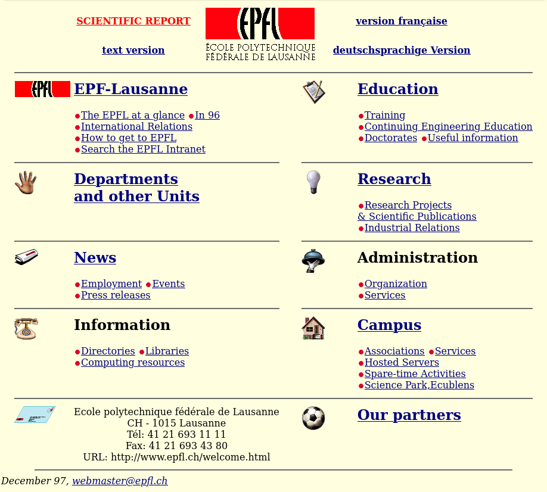

# Stage WordPress@EPFL
<!-- version: v1.1.1 -->
## À propos

Cette fiche de stage s’intègre dans le catalogue de stage proposé aux
apprenti·e·s et stagiaires à l’EPFL.

| Nom                    | WordPress                                           |
| ---------------------- | --------------------------------------------------- |
| Type de stage          | Formation                                           |
| Durée du stage         | 2 à 5 jours*                                        |
| Unité                  | ISAS-FSD                                            |
| Public                 | Tous (apprentis et stagiaires)                      |
| Obligatoire            | Filière développement d’application                 |
| Nombre de participants | 1                                                   |
| Matériel               | Ordinateur portable                                 |
| Prérequis              | Ligne de commande, serveurs Web, Linux un plus      |
| Mots-clés              | WordPress, SSH, CLI, Linux, Apache, MariaDB, Docker |

\* _La durée du stage peut varier en fonction des connaissances préalables du
stagiaire et de la manière dont les différentes tâches sont approfondies._

> **Note**
> La version la plus récente de ce document est disponible sur
> https://go.epfl.ch/stage-WP. Accéder à sa version électronique vous permettra
> de suivre les liens, suggérer des [modifications] ou laisser des
> [commentaires]. Vous pouvez également ajouter une ⭐ au repo pour faire
> plaisir aux contributeurs :)

## Description du stage

* Découvrir le CMS [WordPress] : installation, configuration, utilisation et
  développement ;
* Apprendre comment déployer et mettre en production un site WordPress ;
* Mettre en place un kit de développement WordPress avec [Docker] ;
* Observer et discuter de la pile technologique mise en place à l’EPFL pour les
  sites WordPress.

## Déroulement du stage (dans les grandes lignes)

1. La personne en stage installe WordPress sur sa machine ;
2. La personne en stage installe WordPress sur une machine virtuelle ;
3. La personne en stage installe WordPress sur sa machine, avec Docker ;
4. La personne en stage déploie le WordPress de sa machine sur la machine
   virtuelle ;
5. La personne en stage découvre comment WordPress est géré à l’EPFL.

# Avant de commencer

Ce stage se déroule en plusieurs étapes graduelles pour lesquelles vous devrez
noter votre progression, répondre à des questions puis obtenir la validation du
formateur ou de la formatrice pour passer aux étapes suivantes.

Commencez par créer un document qui vous permettra de prendre des notes et de
répondre aux questions tout au long du stage. Le format du document est libre,
mais si vous êtes indécis, nous vous recommandons d’utiliser [Markdown], le
format des fichiers README sur GitHub.

> **Note**
> Bien que cela ne soit pas le sujet du stage, il est recommandé que vous créiez
> un dépôt [Git] pour votre document et les différents fichiers dont vous
> pourriez avoir besoin lors de ce stage.

- [ ] J’ai un dossier avec mon document prêt

# Première partie : à propos de WordPress

Pour cette première étape, vous devez vous **renseigner** sur [WordPress].
Commencez par ajouter un paragraphe « Qu’est-ce que WordPress » dans votre
document. Ce paragraphe doit contenir un peu d’historique (date de création,
auteur, etc.). Répondez également aux questions : « WordPress est-il beaucoup
utilisé ? », « Combien coûte WordPress ? » et « Quelle est la différence entre
wordpress.com et wordpress.org » en développant vos réponses.

- [ ] J’ai écrit le paragraphe « Qu’est-ce que WordPress »
- [ ] J’ai répondu à la question « WordPress est-il beaucoup utilisé ? »
- [ ] J’ai répondu à la question « Combien coûte WordPress ? »
- [ ] J’ai répondu à la question « Quelle est la différence entre wordpress.com
      et wordpress.org »
- [ ] Je sais ce qu’est un CMS

# Deuxième partie : installation locale

Cette partie est pratique, vous devez **installer WordPress** pour qu’il
fonctionne sur votre ordinateur. Commencez par vous documenter et trouver une
procédure expliquant comment faire en fonction de votre système d’exploitation.
Prenez des notes à chaque étapes pour expliquer comment vous avez fait tout en
citant les références qui vous ont permis d’y arriver. Cette procédure doit être
reproductible !

Ajoutez la procédure d’installation à votre document et répondez à cette
question : « De quoi WordPress a-t-il besoin pour fonctionner ? ».

- [ ] J’explique comment je l’ai installé sur ma machine
- [ ] J’ai listé les éléments dont WordPress avait besoin pour fonctionner

## Validation de la deuxième partie

Avant d’aller plus loin, transmettez votre document à la personne encadrant le
stage et discutez de votre installation avec elle.

- [ ] La procédure d’installation est validée par l’encadrant·e (vous lui
      expliquez la procédure et lui montrez votre site WordPress dans votre
      navigateur)
- [ ] Vous avez disctué avec l’encadrant·e des éléments dont WordPress avait
      besoin pour fonctionner
- [ ] Vous êtes en mesure de dire ce que sont `LAMP`, `MAMP`, `WAMP` et `XAMP`

# Troisième partie : installation distante

Le but de la troisième partie est de pouvoir installer **WordPress sur une
machine distante** (aka le cloud) afin que le site que vous allez créer soit
accessible au monde entier.

Commencez par créer le paragraphe « Procédure d’installation de WordPress sur
une VM distante » dans votre documentation. Cette procédure doit pouvoir être
reproduite par une personne avec peu de connaissances en informatique, elle
doit donc être précise.

Bien que certains hébergeurs proposent des installations automatisées et en
mode graphique[^1], l’idée ici est de tout faire en ligne de commande. Pour
pouvoir débuter, demandez à la personne responsable du stage de créer une
machine virtuelle. Afin d’y accéder, elle va probablement vous demander votre
clé SSH. Si vous n’en avez pas, elle vous accompagnera pour en créer une. Les
étapes de création de la VM et de la clé SSH ne sont pas à protocoler dans votre
documentation.

Lorsque vous êtes connecté sur l’invite de commande du serveur distant,
commencez à protocoler toutes les étapes nécessaires au bon déroulement de
l’installation d’un site WordPress.

Lorsque le site est fonctionnel, demandez-vous si la procédure que vous avez
établie est reproductible. Est-ce qu’on peut tout effacer et reprendre votre
procédure ?

- [ ] J’ai écrit le paragraphe « Procédure d’installation de WordPress sur
      une VM distante »
- [ ] J’ai protocolé toutes les étapes nécessaires à l’installation de WordPress

## Validation de la troisième partie

C’est le moment de valider votre travail avec le formateur ou la formatrice et
iel aura besoin d’un compte administrateur sur votre site. Créez lui un compte
avec comme username son nom d’utilisateur EPFL et comme mot-de-passe le mot EPFL
entouré de son sciper (`123456EPFL123456`).

- [ ] Vous avez créé un compte administrateur pour l’encadrant·e
- [ ] L’encadrant·e peut accéder au site WordPress
- [ ] L’encadrant·e valide votre procédure

## À la découverte de WordPress

Maintenant que vous avez un site WordPress accessible à distance, c’est le
moment de faire le **tour du propriétaire**. Commencez par créer des posts et
des pages, en y incluant des médias.

- [ ] Vous avez créé au moins 2 posts
- [ ] Vous avez créé au moins 2 pages

Parcourez les différents menus de l’interface d’administration, puis demandez
à la personne responsable du stage une visite guidée des fonctionnalités.

- [ ] L’encadrant·e vous a fait une visite guidée du backoffice de WordPress
- [ ] Vous êtes capable d’expliquer la différence entre un post et une page
- [ ] Vous savez installer et changer les thèmes
- [ ] Vous savez installer et changer les plugins
- [ ] Vous avez pris connaissance de l’écosystème des plugins et des thèmes
- [ ] Vous savez utiliser le menu
- [ ] Vous savez comment assigner un menu à un emplacement du thème
- [ ] Vous avez visité le menu `settings` (URL Rewriting, etc.)
- [ ] Vous savez utiliser les catégories et les tags, ainsi que leurs pages
- [ ] Vous savez ce qu’est le «SEO» et un «excerpt»

Prenez un peu de temps pour découvrir ces éléments : parcourrez le catalogue des
thèmes et des plugins et installez-en quelques-un. Observez le comportement du
site après chaque installation.

Vous n’avez pas besoin de documenter l’expérience acquise ci-dessus, mais
vous devez ajouter une copie d’écran de votre site. Vous y ajoutez également
un paragraphe « Que manque-t-il pour que mon site soit opérationnel ? ». Ce
paragraphe doit contenir tout ce dont votre site pourrait avoir besoin pour
fonctionner en production et être visité par un millier d’utilisateurs par jour.

- [ ] J’ai ajouté une capture d’écran dans mon document
- [ ] J’ai écrit le paragraphe « Que manque-t-il pour que mon site soit
      opérationnel ? »

# Quatrième partie : développement avec Docker (Dev)

> **Note**
> Cette partie couvre la partie développement de WordPress et peut
> éventuellement être laissée de côté en fonction des intérêts de l’apprenti·e
> ou du temps à disposition.

Les développeurs WordPress (du CMS, de thèmes ou de plugins) doivent avoir un
environnement de développement leur permettant de rapidement tester leur code
et si possible en tout point similaire à la « production ». En démocratisant
l’utilisation de conteneurs, [Solomon Hykes] a rendu cela possible. « [Docker]
est un outil qui peut empaqueter une application et ses dépendances dans un
conteneur isolé, qui pourra être exécuté sur n’importe quel serveur ».

Dans cette troisième partie vous devez **créer un kit de développement**
WordPress fonctionnant sur votre machine avec [Docker] et [docker compose].

Dans la première partie, vous avez du lister les éléments dont WordPress avait
besoin pour fonctionner. Les éléments principaux doivent être conteneurisés
individuellement.

Même si vous avez déjà un peu d’expérience avec Docker, prenez un moment pour
lire la page [wikipedia][Docker] et vous documenter. Si ce n’est pas déjà fait,
installez-le sur votre machine. Ensuite, prenez une à deux heures pour essayer
de faire fonctionner WordPress avec Docker sur votre machine, puis demandez de
l’aide à la personne responsable du stage.

Votre documentation doit contenir une petite introduction sur Docker et
expliquer en quoi la conteneurisation est différente de la virtualisation. Votre
documentation liste les commandes principales qu’il faut connaître pour utiliser
Docker et plus précisément pour lancer WordPress dans un conteneur sur votre
ordinateur.

- [ ] Vous expliquez ce qu’est [Docker] dans votre document
- [ ] Vous expliquez en quoi la conteneurisation est différente de la
      virtualisation
- [ ] Vous listez les commandes nécessaire à démarrer WordPress sur votre
      ordinateur
- [ ] Votre documentation contient un fichier `docker-compose.yml` fonctionnel
- [ ] Vous êtes en mesure de comprendre la différence entre un Dockerfile,
      Docker et docker compose
- [ ] Vous pouvez expliquer les ports, les volumes et les environnements dans
      le monde de Docker
- [ ] Vous savez "entrer" dans un Docker

Avant de terminer cette partie, vous devez avoir compris les avantages de votre
kit de développement avec Docker. Les informations pour le développement de
WordPress se trouvent sur le Codex (<https://codex.wordpress.org>).

Pour ce faire nous vous proposons d’utiliser le plugin [Hello
Dolly](https://wordpress.org/plugins/hello-dolly/) ou créer votre [propre
plugin](https://developer.wordpress.org/plugins/intro/). Intégrez le plugin dans
le conteneur à l’aide d’un volume, vous devez pouvoir le modifier depuis votre
système (avec votre éditeur favori) puis voir les modifications depuis la page
servie par le conteneur.

Vous devez également être en mesure de naviguer dans la base de données de
WordPress depuis un client SQL de votre choix. Ajouter une capture d’écran du
diagramme entité-association (« entity-relationship diagram », abrégé en ERD) de
la base de données dans votre documentation.

- [ ] Vous avez ajouté un plugin dans un volume et pu le modifier depuis
      l’extérieur du conteneur
- [ ] Vous avez pu connecter un client de base de données à votre conteneur pour
      ajouter une capture d’écran du diagramme entité-association de la DB.

## Validation de la quatrième partie

Avant d’aller plus loin, prenez un moment avec la personne encadrant le stage et
discutez de votre `docker-compose.yml` et des avantages de Docker avec elle.

- [ ] Votre `docker-compose.yml` est validé par l’encadrant·e
- [ ] Vous pouvez expliquer les avantages de Docker

# Cinquième partie : déploiement avec Docker (Ops)

Maintenant que vous avez un kit de développement adapté, vous voulez faire
le nécessaire pour **déployer en « prod »** vos modifications. Réutilisez
la machine virtuelle de la deuxième partie (vous pouvez éventuellement la
réinstaller) et installez-y Docker.

Récupérez votre `docker-compose.yml` (idéalement à l’aide de la commande
`git clone https://github.com/vous/wp-dev-kit`) ainsi que le
code spécifique à vos développements.

Avec des commandes similaires à celles que vous avez utilisées sur votre
ordinateur, démarrer votre « stack » WordPress sur le serveur. Documentez ces
étapes dans votre documentation, et répondez à la question : « Mon déploiement
en prod est-il en tout point similaire à celui sur mon ordinateur ? ».

- [ ] Vous documentez la procédure de déploiement en production
- [ ] Vous répondez à la question « Mon déploiement en production est-il en tout
      point similaire à celui sur mon ordinateur ? »

À ce point, il est supposé que les quelques étapes pour déployer en production
ont été étonnamment faciles, est-ce bien le cas ? Si oui, cela a permis de
démontrer un avantage de Docker : la portabilité.

## Est-on prêt pour la prod ?

Votre documentation devrait avoir un paragraphe « Que manque-t-il pour que mon
site soit opérationnel ? », écrit lors de la troisième partie de ce stage.
Discutez avec la personne responsable du stage de ce qu’il manque à votre site
pour être utilisable, par exemple :

* Est-ce que le site peut envoyer des emails, par exemple lorsqu’un
  mot-de-passe est perdu ?
* Est-ce que le site est sécurisé par HTTPS assurant que les informations
  transitant entre le client et le serveur soient chiffrées ?
* Est-ce que les informations importantes du site sont sauvegardées et
  pourraient être utilisées dans un plan de reprise d’activité ([PRA]) ?
* Qui pourra accéder à votre site ? Est-il nécessaire de mettre en place un
  système d’authentification basé sur celui de l’entreprise ?
* ...

En discutant avec l’encadrant·e, définissez ce qui doit être fait (par exemple
la mise en place d’un certificat TLS/SSL avec [Let’s encrypt] et la
configuration d’une passerelle SMTP pour envoyer des e-mails).

- [ ] Vous discutez avec l’encadrant·e de ce qui manque au site
- [ ] Vous êtes capable de mettre en place un certificat ou du moins d’en
      expliquer les étapes
- [ ] Vous êtes en mesure d’installer une passerelle SMTP
- [ ] Vous savez ce qu’est un SSO
- [ ] L’encadrant·e valide votre cinquième partie

# Sixième partie: WordPress@EPFL

En atteignant cette sixième partie vous devriez maintenant être à l’aise avec
WordPress et son environnement. L’objectif de ce chapitre est de partager et
d’expliquer comment le **CMS WordPress a été mis en place à l’EPFL** et de
décrire la pile technologique utilisée pour le gérer.

## Historique

Le premier site Internet de l’École Polytechnique Fédérale de Lausanne a vu le
jour en 1997 :  

Tout au long des années, suivant l’évolution du Web et faisant recours a
divers systèmes de gestion de contenu[^2], différentes versions du site
Internet de l’EPFL ont vu le jour ([1998], [2004], [2007], [2010], [2014]) pour
finalement adopter WordPress en [2019].

## Volumétrie

Lorsque quelqu’un navigue sur le site <https://www.epfl.ch>, il a l’impression
de visiter un gros site Internet. Il s’avère qu’il s’agit en fait d’une
multitude de petits sites qui sont agrégés ensembles.

- [ ] Posez-vous la question de combien de sites sont agrégés ensembles
- [ ] Pourquoi pensez-vous que cette façon de faire a été choisie ?

## Traitement individuel vs. traitement de masse

L’ordre de grandeur du nombre de site à l’EPFL rend impossible le traitement
individuel. Imaginez qu’une personne soit chargée de la mise à jour des sites,
et que cela prenne une heure par site. Si la personne peut mettre à jour 8 sites
par jour, combien de temps prendrait la mise à jour de la totalité de la flotte
? Est-ce compatible avec le cycle de nouvelles version mentionné dans la page
[How the Release Cycle Works] (tous les 4 mois) ?

Nous aimons à penser que nous traitons les sites WordPress comme du bétail :
les sites sont mis à jour en masse et nous nous occupons individuellement des
cas particuliers, au même titre qu’un agriculteur s’occupe d’une bête qui boîte
dans son troupeau.

## Pile technologique

Vous êtes peut-être en train de vous demander quelle solution technologique vous
metteriez en place si vous êtiez en charge du projet. Il y a assurément
plusieurs solutions ! Les paragraphes suivants décrivent les solutions mises en
place à l’EPFL.

### Kubernetes

La page [What is Kubernetes] décrit Kubernetes comme étant une plate-forme
Open Source extensible et portable pour la gestion de charges de travail
(workloads) et de services conteneurisés. Elle favorise à la fois l’écriture
de configuration déclarative et l’automatisation. C’est un large écosystème en
rapide expansion.

Les sites de l’EPFL sont déployés sur une version de Kubernetes de Red Hat,
qui s’appelle OpenShift. Le serveur web est [Apache] et la base de données
[MariaDB]. Un système de [cache] interne est mis en place avec [Varnish].
L’accès de l’extérieur est fait via [Cloudflare], ce qui permet d’avoir un cache
en amont et de se protéger contre les attaques DDoS.

### Monitoring, observabilité et alerting

Une vue d’ensemble de l’état des sites est disponible sur l’outil [Grafana].
Différentes sondes sont disponibles et permettent de recueillir des métriques
qui sont regroupées dans [Prometheus]. Les logs des différents conteneurs sont
aiguillés vers [Kibana]. Finalement, il est possible d’utiliser ces informations
pour mettre en place des systèmes d’alertes permettant d’être informé rapidement
en cas de panne.

### Configuration as code

Les opérations sur la flotte, telle que la création d’un nouveau site, les
backups, les mises à jour et une partie de l’infrastructure sont décrites
dans du code, c’est-à-dire qu’elles sont reproductibles et documentées. Les
opérateurs (les personnes qui sont en charge d’opérer la plateforme WordPress)
peuvent utiliser différentes commandes depuis leurs ordinateurs respectifs afin
de gérer la plateforme.

Le logiciel utilisé s’appelle [Ansible]. Il est utilisé d’une manière qui permet
de s’affranchir de la complexité du système : les apprentis sont par exemple en
mesure de lancer les commandes de mise à jour de la totalité de la flotte en
production sans pour autant devoir comprendre tous les éléments.

### Secrets, DevOps et 12 facteurs

Le partage des secrets permettant d’accéder aux différents éléments de la
plateforme (aka « qui à le droit de péter la prod » !) est principalement fait
avec l’outil [Keybase]. Parmi d’autres choses, Keybase offre un stockage
chiffré dans le cloud, Keybase File System. Les opérateurs, via le client
Keybase, ont alors accès aux fichiers sur un point de montage de leur système.

Les différents scripts ([Ansible]) peuvent alors utiliser le principe de
« inclus ce fichier contenant les mot-de-passes si tu en as le droit, sinon
tant pis pour toi », délégant le contrôle d’accès aux secrets à Keybase et à la
personne y ayant accès.

De manière plus générale, il est aussi intéressant de mentionner la méthodologie
[DevOps] qui regroupe les pratiques techniques visant à l’unification du
développement logiciel (dev) et de l’administration des infrastructures
informatiques (ops).

En addition à la méthodologie [DevOps], la méthodologie des [12 facteurs] (« The
Twelve-Factor App ») est également appliquée.

L’approche qui a été mise en place pour la création de la plateforme des sites
WordPress de l’école se veut respectueuse de ces deux méthodologies.

### Code opensource

Enfin et surtout, la totalité du code utilisée sur la plateforme WordPress de
l’EPFL est disponible sur GitHub :

* Le dépôt contenant le kit de développement :
  <https://github.com/epfl-si/wp-dev>
* Le code Ansible pour le déploiement et le maintien de la plateforme :
  <https://github.com/epfl-si/wp-ops>
* Le thème WordPress de l’EPFL, <https://github.com/epfl-si/wp-theme-2018>,
  utilisant la charte graphique disponible sur
  <https://epfl-si.github.io/elements>
* Les différents plugins, pouvant être listé en recherchant
  [`wp`](https://github.com/epfl-si?q=wp)

## Validation de la sixième partie

Discutez de ce chapitre avec la personne encadrant le stage, si vous le
souhaitez il est peut être possible de participer au déploiement en production
de nouvelles fonctionnalités sur la flotte des sites WordPress, voir même d’en
être l’acteur.

Pour cette partie vous êtes libre de décrire, dans le paragraphe
« WordPress@EPFL », ce que vous avez retenu et de développer les parties qui
vous intéressent.

- [ ] J’ai ajouté le paragraphe « WordPress@EPFL » dans mon document
- [ ] L’encadrant·e du stage m’a montré différents éléments de la pile
      technologique utilisée
- [ ] J’ai discuté avec l’encadrant·e des différents aspects présents dans ce
      chapitre

# Dernière partie : wrap up

C’est la dernière parie du stage, l’objectif est de **compléter votre
document**.

Votre document doit mentionner 3 alternatives à WordPress ; si pour une
raison quelconque l’utilisation de Wordpress n’est pas possible, quels CMS
pourraient-on utiliser ? Ou, en d’autres termes, quels sont les concurrents à
WordPress ?

Le fait que WordPress soit un logiciel libre et gratuit est intéressant. Qui
s’occupe de le développer ? Quel est le modèle commercial (comment gagnent-ils
de l’argent) ? Ajoutez un paragraphe qui traite de ces sujets s’ils ne sont pas
pas déjà traités.

WordPress est très utilisé, pouvez-vous citez des sites connus qui l’utilise ?

- [ ] J’ai mentionné au moins 3 alternatives à WordPress dans mon document
- [ ] Je parle de la licence, de la gratuité et du modèle commercial
- [ ] J’ai mentionné des sites connus qui l’utilise

## Conclusion

C’est le moment d’ajouter la conclusion à votre rapport. La conclusion doit
traiter au moins des points suivants, permettant de faire une synthèse sur le
tavail que vous avez fournit durant le stage :

 * Les avantages et inconvénients de WordPress ;
 * WordPress est-il un bon choix pour les sites de l’EPFL ;
 * Bilan du stage : ce que vous avez appris, ce que vous avez aimé, ce que vous
   avez moins aimé.

- [ ] J’ai ajouté le paragraphe « Avantages et inconvénients de WordPress »
- [ ] J’ai ajouté le paragraphe « WordPress est-il un bon choix pour l’EPFL »
- [ ] J’ai ajouté le paragraphe « Bilan du stage » avec ce que j’ai appris, aimé
      ou moins aimé

# Envoi final

Relisez attentivement votre document pour vérifier l’orthographe, la mise en
page, la qualité de vos procédure, etc. puis générez un PDF (par exemple en
utilisant [Pandoc] si vous l'avez écrit au format [Markdown]), avec comme nom
`Stage_WP_ISAS-FSD_YYYY-MM_Rapport_Prénom_Nom.pdf`.

Avant de l’envoyer à personne encadrant votre stage et à vos formateurs et
formatrices, renseignez-vous pour savoir s’il est nécessaire de remplir un
rapport de stage. Le cas échéant, le rapport de stage est disponible sur le
[site du canton de vaud](https://www.vd.ch/fileadmin/user_upload/themes/formation/orientation/fichiers_pdf/apprentissage/rapp_stage_stag.pdf) ou en [version web](https://azecko.github.io/rapport-de-stage/)).
Une fois complété, sauvez-le en PDF, avec comme nom
`Stage_WP_ISAS-FSD_YYYY-MM_Évaluation_Prénom_Nom.pdf`.

Vous pouvez maintenant écrire le mail de fin de stage avec les documents
adéquats en attachement. Pensez à communiquer les éventuels liens nécessaires
pour accéder à votre document en ligne ou à votre dépôt Git.

- [ ] J’ai remplis l’évaluation (rapport de stage) et j’en ai fait un PDF
- [ ] J’ai créé un PDF basé sur ma documentation et l'ai nommé correctement
- [ ] J’ai envoyé par email, aux personnes responsables du stage et à mes
      formateur·trice·s, tous mes documents

---

> **Note**
> La version la plus récente de ce document est disponible sur
> https://go.epfl.ch/stage-WP. Accéder à sa version électronique vous permettra
> de suivre les liens, suggérer des [modifications] ou laisser des
> [commentaires]. Vous pouvez également ajouter une ⭐ au repo pour faire
> plaisir aux contributeurs :)

<!-- Faire un test de controle de connaissances ? -->

[Markdown]: https://fr.wikipedia.org/wiki/Markdown
[Git]: https://fr.wikipedia.org/wiki/Git
[WordPress]: https://wordpress.com/
[Solomon Hykes]: https://fr.wikipedia.org/wiki/Solomon_Hykes
[Docker]: https://fr.wikipedia.org/wiki/Docker_(logiciel)
[docker compose]: https://docs.docker.com/compose/
[PRA]: https://fr.wikipedia.org/wiki/Plan_de_reprise_d%27activit%C3%A9
[Let’s encrypt]: https://letsencrypt.org/
[How the Release Cycle Works]: https://make.wordpress.org/core/handbook/about/release-cycle/
[What is Kubernetes]: https://kubernetes.io/fr/docs/concepts/overview/what-is-kubernetes/
[Apache]: https://httpd.apache.org
[MariaDB]: https://mariadb.org
[cache]: https://fr.wikipedia.org/wiki/M%C3%A9moire_cache
[Varnish]: https://varnish-cache.org
[Cloudflare]: https://fr.wikipedia.org/wiki/Cloudflare
[Grafana]: https://grafana.com
[Prometheus]: https://prometheus.io
[Kibana]: https://www.elastic.co/kibana
[Ansible]: https://www.ansible.com
[Keybase]: https://fr.wikipedia.org/wiki/Keybase
[DevOps]: https://fr.wikipedia.org/wiki/Devops
[12 facteurs]: https://12factor.net/fr/
[Pandoc]: https://pandoc.org
[modifications]: https://github.com/ponsfrilus/fiche-de-stage-WordPress/pulls
[commentaires]: https://github.com/ponsfrilus/fiche-de-stage-WordPress/issues/new

[1998]: ./img/1998.png
[2004]: ./img/2004.png
[2007]: ./img/2007.png
[2010]: ./img/2010.png
[2014]: ./img/2014.jpg
[2019]: ./img/2019.png

[^1]: Par exemple en proposant <https://www.virtuozzo.com>,
      <https://www.plesk.com/> ou <https://cpanel.net/>
[^2]: Dont Jahia (<https://www.jahia.com>)

[//]: # `export VERSION=$(sed -n -e 's/<!-- version:\s\(.*\)\s-->/\1/p' README.md); pandoc README.md --pdf-engine=xelatex --variable urlcolor=cyan -V papersize:a4paper -V geometry:margin=2cm -o $(date +"%Y-%m-%d")_Stage_WordPress_ISAS-FSD_${VERSION}.pdf && xpdf $(date +"%Y-%m-%d")_Stage_WordPress_ISAS-FSD_${VERSION}.pdf`
